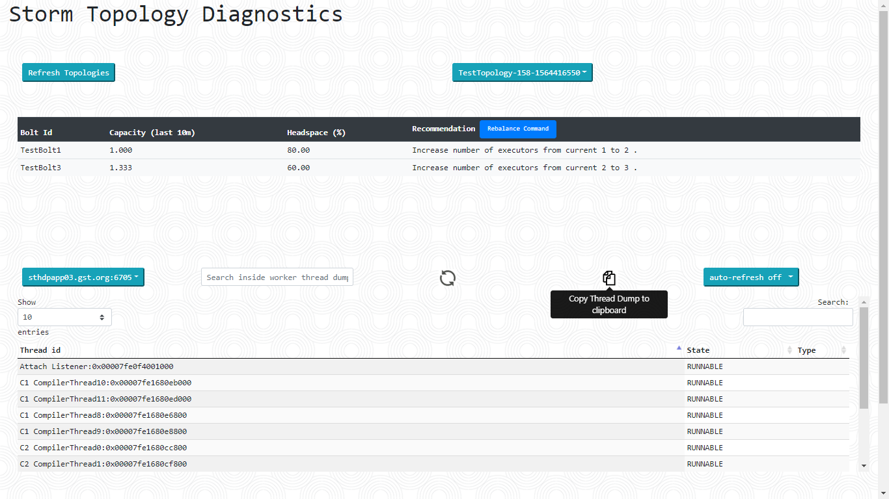
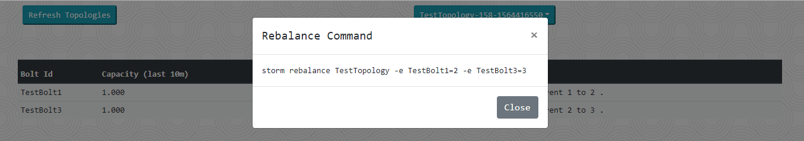

# Storm Topology Diagnostics Tool

A friendly tool to diagnose issues in Apache Storm topologies


## Table Of Contents

- [Storm Topology Diagnostics Tool](#storm-topology-diagnostics-tool)
  - [Table Of Contents](#table-of-contents)
  - [Why This Tool?](#why-this-tool)
  - [Two-Minute Quick Start](#two-minute-quick-start)
  - [Introduction](#introduction)
    - [Sample Screenshot](#sample-screenshot)
    - [Bolts Table:](#bolts-table)
    - [Select A Topology Worker](#select-a-topology-worker)
  - [License](#license)


## Why This Tool?
- Help identify Topology Bolts that need rebalancing
- Identify bolts that have maxed out tasks (executors = tasks)
- Provide facility to view detailed thread-level information (with search functionality) to detect performance bottlenecks, deadlocks
 
## Two-Minute Quick Start

1. Build the jar
```
lein uberjar
```

2. **Download** [myconfig.edn](/myconfig.edn) and [runTool.sh](/runTool.sh)

3. **Edit myconfig.edn** Provide values for storm-log-dir, storm-ui-ip and storm-ui-port used in your Storm cluster in the myconfig.edn file

```Clojure
{
 :prod true

 ; the tool's webui port
 ; e.g.
 ; :port 8081
 :port 8080

 ; log directory configured for storm
 ; this is configured as storm.log.dir in storm.yaml
 ; e.g. :storm-log-dir "/var/log/storm"
 :storm-log-dir "<enter path configured for storm.log.dir (as in storm.yaml) here>"

 ; IP address of machine serving Storm UI
 ; e.g.
 ;:storm-ui-ip "192.168.14.11"

 :storm-ui-ip "<enter IP address of Storm UI here>"

 ; port used by Storm UI
 ; e.g.
 ; storm-ui-port 8080

 :storm-ui-port <enter port of Storm UI here>
}
```

4. **Copy** myconfig.edn, runTool.sh and teacup.jar to all Storm worker nodes (all three files in the same directory path)

5. **Start the tool** in all the worker nodes

```Shell
$ ./runTool.sh &
```

6. **Start using the tool** from the url http://<any storm worker ip address>:<tool's webui port, as configured in myconfig.edn>/inspect

## Introduction

This is a web based tool to assist Apache Storm cluster admins to gain useful information about the Topologies and the worker processes. This tool is *not* a replacement for the Storm UI, rather it can be used along with Storm UI tool. The tool lets the user analyze a topology and any worker process associated with the topology. At the topology level, suggestions (for rebalancing the bolts) are provided. The user can view thread-level information for the selected worker in a convenient interface.

### Sample Screenshot



List of available topologies is auto-populated based on myconfig.edn file. Any recommendations, with respect to increasing the tasks or the executors is displayed in a Bolts table once the topology is selected from the list of available topologies.


### Bolts Table:

This table displays information about those bolts of selected topology for which there are some recommendations. Recommendation logic is specified below in Recommendation section. If there is no recommendation for any of the bolts then it displays "No Recommendation". This table contains following information:
	
* **Bolt Id** : Id of the bolt.

* **Capacity (last 10m)** : Capacity of the bolt for last 10 minutes.

* **Headspace (%)** : It is calculated using formula  **((t - n)*100)/(t)**,  where t is number of tasks  and n is number of executors of the bolt. Higher the headspace, better it is. 

* **Recommendation** : It shows recommendations for this bolt. Recommendation can include either or both of the following:

	* **Increase number of executors from current x to y** : If last 10 min. capacity of the bolt is more than or equal to 0.8 it gives this recommendation. The amount of increase in executors is in proportion to reduction in capacity to bring it down to 0.7.   
	
	* **Increase number of tasks from current x to y** : If headspace percentage is less than or equal to 20 this recommendation is given. The amount of increase in tasks is in proportion to increase in headspace to take it up to 30%.
	
* **Rebalance Command** : This button appears next to Reccomendation, only in some scenarios as explained here. Increasing number of executors can be done using storm rebalance command, however increasing number of tasks is only possible through topology configuration which is done in code and would require topology redeployment. So if one or more bolts have recommendation to only increase number of executors and not tasks, then rebalance is possible for such bolts. So only in this scenario "Rebalance Button" appears next to Recommendation header and on clicking on that button rebalance command is displayed in pop-up window. 	

  

### Select A Topology Worker

The list of workers for the selected topology gets populated in the dropdown that is present below the bolts table.

Upon selecting a worker from the list of available workers, the current thread dump of worker is fetched from the worker node and is displayed in the thread information area. The latest thread information at any point in time can be obtained by clicking on the refresh button.

The thread dump refresh can be set in auto-refresh mode by selecting the refresh interval. This can help identify any stationary thread and can be useful in identifying deadlocks/performance issues. Auto refresh will happen for 5 intervals.


## License
This project is licensed under Apache License version 2.0. This project depends upon other third party open source components which have their own license terms. Please refer LICENSE-THIRD-PARTY file for more information.

Copyright © 2019 Goods and Services Tax Network
